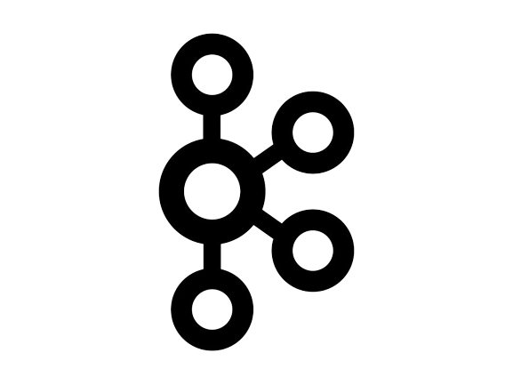

# 책도네

## 목차
1. [**서비스 소개**](#1)
2. [**프로젝트 일정**](#2)
3. [**팀원 소개**](#3)
4. [**기술 스택**](#4)
5. [**시스템 아키텍처**](#5)
6. [**주요 기능**](#6)

## 💡 서비스 소개

### 책도네

> 중고 도서를 주고받으며  
> 지속적인 선순환을 유도하는 서비스  

 

## 📆 프로젝트 기간

### 23.07.10 ~ 23.08.18

- 기획 및 설계 : 23.10.10 ~ 23.10.18
- 프로젝트 구현 : 23.10.19 ~ 23.11.15
- 버그 수정 및 산출물 정리 : 23.11.16 ~ 17

 

## 👪 팀원 소개

<table>
    <tr>
        <td height="140px" align="center"> <a href="https://github.com/chakunyoung">
                👑 차건영  (Back-End) </a>  </td>
        <td height="140px" align="center"> <a href="https://github.com/DeadBBall">
                😁 김용균  (Back-End) </a>  </td>
        <td height="140px" align="center"> <a href="https://github.com/sangilji">
                🙂 지상일  (Back-End) </a>  </td>
        <td height="140px" align="center"> <a href="https://github.com/eastsage">
                😆 이동현  (Back-End) </a>  </td>
        <td height="140px" align="center"> <a href="https://github.com/hyeii">
                🙄 윤혜민  (Front-End) </a>  </td>
    </tr>
</table>

 

## 🛠️ 기술 스택

|                 Flutter                 |                 Dart                 |                 Riverpod                 |                 Firebase                 |           Spring Boot            |         Jenkins         | Docker  |                 Redis                 |                 Kafka                 |            MySQL            |             EC2             |                   Elastic Search                    |
|:---------------------------------------:|:------------------------------------:|:----------------------------------------:|:----------------------------------------:|:--------------------------------:|:-----------------------:|:-------:|:-------------------------------------:|:-------------------------------------:|:---------------------------:|:---------------------------:|:---------------------------------------------------:|
|  |  |  |  |||||  |||  |

 

## 🗂️ 시스템 아키텍처

 

## 💻 주요 기능

### 메인 & About Us

 
