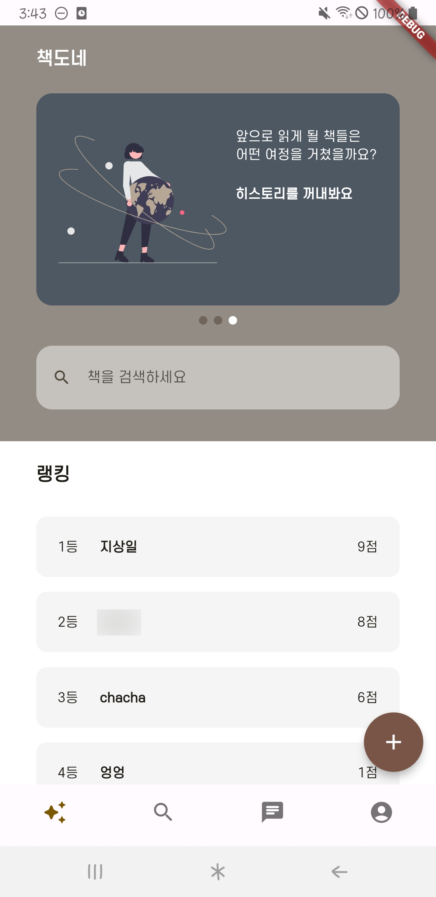

# 책도네

## 목차

1. [**서비스 소개**](#1)
2. [**프로젝트 일정**](#2)
3. [**팀원 소개**](#3)
4. [**기술 스택**](#4)
5. [**시스템 아키텍처**](#5)
6. [**주요 기능**](#6)

## 💡 서비스 소개

### 책도네

> 중고 도서를 주고받으며  
> 지속적인 선순환을 유도하는 서비스  

 

## 📆 프로젝트 일정

### 23.10.10 ~ 23.11.17

- 기획 및 설계 : 23.10.10 ~ 23.10.18
- 프로젝트 구현 : 23.10.19 ~ 23.11.15
- 버그 수정 및 산출물 정리 : 23.11.16 ~ 17

 

## 👪 팀원 소개

<table>
    <tr>
        <td height="140px" align="center"> <a href="https://github.com/chakunyoung">
                👑 차건영  (Back-End) </a>  </td>
        <td height="140px" align="center"> <a href="https://github.com/DeadBBall">
                😁 김용균  (Back-End) </a>  </td>
        <td height="140px" align="center"> <a href="https://github.com/sangilji">
                🙂 지상일  (Back-End) </a>  </td>
        <td height="140px" align="center"> <a href="https://github.com/eastsage">
                😆 이동현  (Back-End) </a>  </td>
        <td height="140px" align="center"> <a href="https://github.com/hyeii">
                🙄 윤혜민  (Front-End) </a>  </td>
    </tr>
</table>

 

## 🛠️ 기술 스택

|                 Flutter                 |                 Dart                 |                 Riverpod                 |                 Firebase                 |                Spring Boot                 |                 Jenkins                 |                 Docker                 |                 Redis                 |                 Kafka                 |                 MySQL                 |                 EC2                 |                 Elastic Search                 |
| :-------------------------------------: | :----------------------------------: | :--------------------------------------: | :--------------------------------------: | :----------------------------------------: | :-------------------------------------: | :------------------------------------: | :-----------------------------------: | :-----------------------------------: | :-----------------------------------: | :---------------------------------: | :--------------------------------------------: |
|  |  |  |  |  |  |  |  |  |  |  |  |

 

## 🗂️ 시스템 아키텍처

 

## 💻 주요 기능

### 온보딩 & 카카오 로그인

 

### 메인 화면 및 랭킹

### 도서 검색 및 자동완성

 

### 책 정보 상세 및 관심도서 설정

 

### 도서 당 지역별 현재 기부 글 내역 및 보유중인 지역 안내

 

### 나눔 신청 및 채팅 시작, 푸시 알림

- 나눔 신청
   

 

- 새로운 채팅 알림 및 채팅 확인

     
  
- 채팅 및 기부 상태 변경 알림  
 

 

### 거래 완료 후 보유중인 책 히스토리 작성

 

### 거래 후 책갈피 변경(피기부자, 기부자)

- 피기부자는 1 감소, 기부자는 1 증가

 

 

### 새로운 책 기부하기 및 책도네로 기부 받은 책 기부하기

- ISBN 바코드 조회 => 책 정보 자동 업로드 및 나눔 희망 지역, 내용, 사진 업로드

 

 
